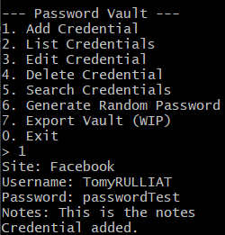
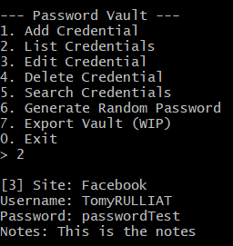
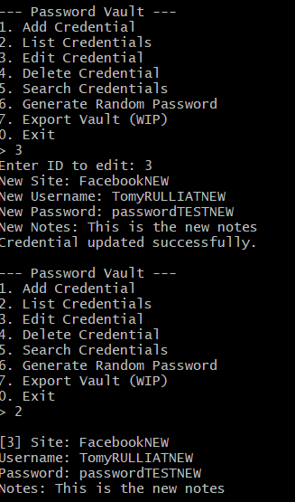
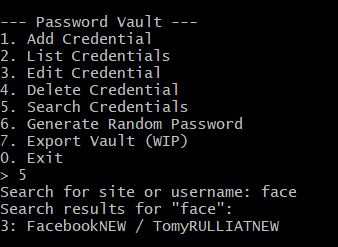
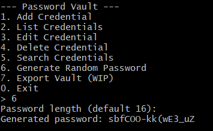
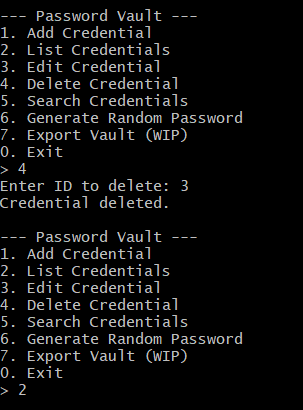
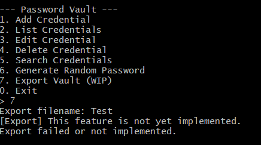

# Password Vault 🇫🇷

## 📌 Contexte

Ce projet a été réalisé dans le cadre d’un stage Erasmus à l’étranger. L’objectif était de créer un gestionnaire de mots de passe sécurisé en C++, avec une base de données SQLite locale, en appliquant la programmation orientée objet, la cryptographie (via OpenSSL) et une interface en ligne de commande.

## ✅ Fonctionnalités

- Ajout de nouvelles entrées de mot de passe (chiffrées)
- Liste des identifiants enregistrés (avec déchiffrement à l’affichage)
- Modification et suppression d’une entrée existante
- Générateur de mot de passe sécurisé
- Recherche d’entrées
- Export des données chiffrées (structure en place, à finaliser)
- Système de mot de passe maître (master password)

## 📥 Installation

### 1. Prérequis

- Un compilateur C++ (g++, clang, etc.)
- SQLite3
- OpenSSL (`libssl-dev` sur Linux)
- CMake ou compilation manuelle

### 2. Clonage du projet

```bash
git clone https://github.com/TomyRulliat-3ICS/ErasmusTask5.git
```

### 3. Compilation

```bash
g++ PasswordVault.cpp -o vault -lssl -lcrypto -lsqlite3
```

### 4. Lancement

```bash
./vault
```

## ⚠️ Problèmes rencontrés

- Difficulté à configurer les chemins d’inclusion pour les headers OpenSSL sur Windows (erreur `cannot open source file "openssl/conf.h"`)
- Débogage de la cryptographie AES avec gestion des exceptions
- Compatibilité des versions entre SQLite et les bibliothèques système
- Gestion de la mémoire avec les pointeurs et les buffers dans OpenSSL

## 🧪 Tester l’application

À chaque fonctionnalité, des captures d’écrans peuvent être ajoutées. Voici les points à tester manuellement :

- ✅ Lancer le programme
- ✅ Ajouter un identifiant avec un mot de passe

- ✅ Lister les identifiants et voir le mot de passe en clair

- ✅ Modifier un identifiant

- ✅ Rechercher un identifiant (par site ou nom d’utilisateur)

- ✅ Générer un mot de passe fort automatiquement

- ✅ Supprimer une ligne

- 🔜 Exporter le fichier chiffré pour sauvegarde



## 🧠 Auteur

Projet réalisé par Tomy RULLIAT dans le cadre d’un stage technique à l’international. Le but était de pratiquer la programmation sécurisée, la gestion de projet, la documentation et le travail en autonomie.
